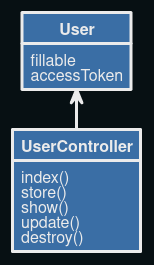

# Setting up and Running a Laravel API
Below is a detialed explanation of how to setup and run this API on your local machine.

## Requirements
1. Ensure you have a development environment such as XAMMP, MAMP, WAMP.
2. Make sure you have git installed on your system.
3. Make sure you have composer installed on your system. Laravel uses composer for package management.

## Steps to setup and run the API
### Step 1: Clone from github
1. Open your terminal or command prompt
2. Navigate to the directory where you want to clone the repository using.
3. Clone the github repository using the folloing command: git clone <repository-url>

### Step 2: Configure the environment variables
1. Go to the root directory of your laravel cloned project, you will find a file name '.env.example'
2. Duplicate this file and rename it to .env
3. Open the .env file in a text editor and configure your databse connnection details as follows:
    DB_CONNECTION=mysql
    DB_HOST=127.0.0.1
    DB_PORT=3306
    DB_DATABASE=your_database_name
    DB_USERNAME=your_database_username
    DB_PASSWORD=your_database_password

    NB: The datase should be created already in your local database

### Step 3: Install dependencies
1. Open your terminal or command line and navigate to the root directory
2. Run the following command to install all the dependencies using composer:  'composer install'

### Step 4: Generate an application key
1. Open your terminal and navigation the project root directory
2. Run the following to command to generate the application key: 'php artisan key:generate'

### Step 5: Migrate Database
1. Open your terminal and navigate to the root directory
2. Run the following command to create all database tables: 'php artisan migrate'

### Step 6: Start Development Server
1. Open your terminal and navigate to the root directory
2. Run the following command to start the server: 'php artisan serve'
3. Open a browser and access the url provided (http://127.0.0.1:8000/api).

Your laravel api is now fully setup, running on your local machine.

## UML Diagram for the model and API classes

